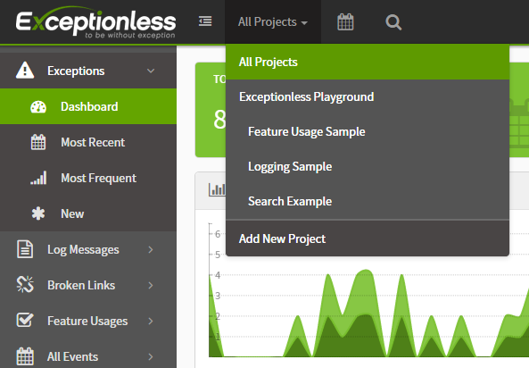
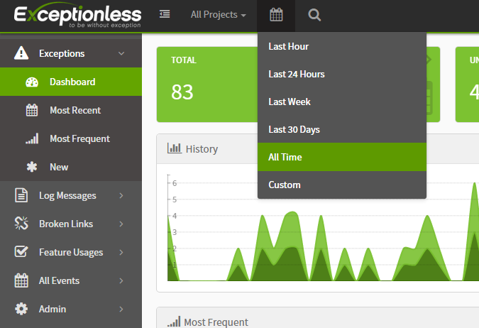
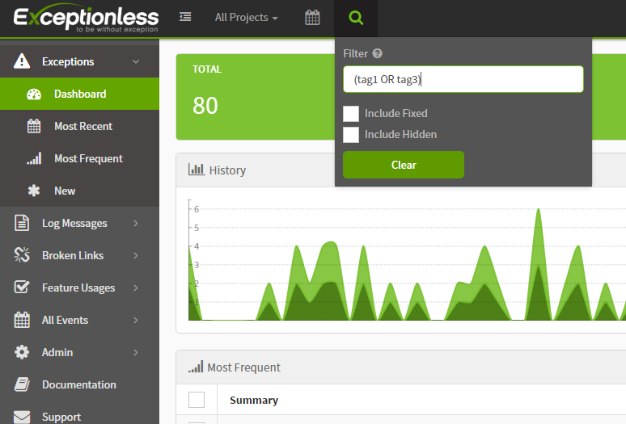

- [Filter by Organization & Project](#filter-by-organization-and-project)
- [Filter by Time Frame](#filter-by-time-frame)
- [Filter / Search by Specific Criteria](#filter-search-by-specific-criteria)
- [Searchable Fields & Requirements](#searchable-fields--requirements)
- [Multiple Queries](#multiple-queries)
- [Wild Cards](#wild-cards)
- [Exclusions](#exclusions)
- [Set and Unset Fields](#set-and-unset-fields)
- [Ranges](#ranges)
- [Custom Extended Data](#custom-extended-data)
- [Demo Video](#demo-video)

## Filter by Organization & Project

The dashboard loads up with all projects selected by default.

Click on the “All Projects” drop down in the top left of the dashboard and select your organization or project to filter the data to your liking.

## Filter by Time Frame

Click on the calendar icon in the header to select from multiple preset time frame filters, or click "Custom" and select your own.

## Filter / Search by Specific Criteria

Click the magnifying glass to search by specific criteria.

You can filter by tag, ID, organization, project, stack, type, value, IP, architecture, user, and much more.

Some searches, such as ID, require a prefix (“id:”) on the search, but others, such as error.message, can be entered as strings (“A NullReferenceException occurred”).

View a complete list of searchable terms, examples, and FAQs below.

## Searchable Fields & Requirements

| TERM               | EXAMPLE                                                                                                              | FIELD REQUIRED? (field:term) | DESCRIPTION                                   |
| ------------------ | -------------------------------------------------------------------------------------------------------------------- | ---------------------------- | --------------------------------------------- |
| `*`                | `*`                                                                                                                  | false                        | Shows all events (including hidden and fixed) |
| id                 | `id:54d8315ce6bb2d0500bcc7b4`                                                                                        | true                         | Documents id                                  |
| organization       | `organization:54d8315ce6bb2d0500bcc7b4`                                                                              | true                         | Organization id                               |
| project            | `project:54d8315ce6bb2d0500bcc7b4`                                                                                   | true                         | Project id                                    |
| stack              | `stack:54d8315ce6bb2d0500bcc7b4`                                                                                     | true                         | Stack id                                      |
| reference          | `reference:12345678`                                                                                                 | true                         | Reference id                                  |
| session            | `session:12345678`                                                                                                   | true                         | Session id                                    |
| type               | `type:error`                                                                                                         | true                         | Event type                                    |
| source             | `source:"my log source"` or `"my log source"`                                                                        | false                        | Event source                                  |
| level              | `level:Error`                                                                                                        | true                         | Log level                                     |
| date               | `date:"2020-10-16T12:00:00.000"`                                                                                     | true                         | Occurrence date                               |
| first              | `first:true`                                                                                                         | true                         | True if first occurrence of event             |
| message            | `message:"My error message"` or `"My error message"`                                                                 | false                        | Event message                                 |
| tag                | `tag:"Blake Niemyjski"` or `tag:Blake` or `blake`                                                                    | false                        | Tags                                          |
| value              | `value:1`                                                                                                            | true                         | Value of event (used in charts)               |
| status             | `status:open` or `status:discarded` or `status:fixed` or `status:regressed` or `status:snoozed` or `status:ignored` | true                         | Stack status                                  |
| version            | `version:1` or `version:1.0` or `version:1.0.0`                                                                      | true                         | Application version                           |
| machine            | `machine:Server` or `Server`                                                                                         | false                        | Machine name                                  |
| ip                 | `ip:127.0.0.1` or `127.0.0.1`                                                                                        | false                        | IP address                                    |
| architecture       | `architecture:x64`                                                                                                   | true                         | Machine architecture                          |
| useragent          | `useragent:IE` or `useragent:"Mozilla/5.0"`                                                                          | true                         | User Agent                                    |
| path               | `path:"/cart"` or `"/cart"`                                                                                          | false                        | URL path                                      |
| browser            | `browser:Chrome`                                                                                                     | true                         | Browser                                       |
| browser.version    | `browser.version:50.0`                                                                                               | true                         | Browser version                               |
| browser.major      | `browser.major:50`                                                                                                   | true                         | Browser major version                         |
| device             | `device:iPhone`                                                                                                      | true                         | Device                                        |
| os                 | `os:iOS`                                                                                                             | true                         | Operating System                              |
| os.version         | `os.version:8.0`                                                                                                     | true                         | Operating System version                      |
| os.major           | `os.major:8`                                                                                                         | true                         | Operating System major version                |
| bot                | `bot:true`                                                                                                           | true                         | bot                                           |
| error.code         | `error.code:500` or `500`                                                                                            | false                        | Error code                                    |
| error.message      | `error.message:"A NullReferenceException occurred"` or `"A NullReferenceException occurred"`                         | false                        | Error message                                 |
| error.type         | `error.type:"System.NullReferenceException"` or `"System.NullReferenceException"`                                    | false                        | Error type                                    |
| error.targettype   | `error.targettype:"System.NullReferenceException"` or `"System.NullReferenceException"`                              | false                        | Error target type                             |
| error.targetmethod | `error.targetmethod:AssociateWithCurrentThread` or `AssociateWithCurrentThread`                                      | false                        | Error target method                           |
| user               | `user:"random user identifier"` or `"random user identifier"`                                                        | false                        | Uniquely identifies user                      |
| user.name          | `user:"Exceptionless User"` or `"Exceptionless User"`                                                                | false                        | Friendly name of user                         |
| user.description   | `user.description:"I clicked the button"` or `"I clicked the button"`                                                | false                        | User Description                              |
| user.email         | `user.email:"support@exceptionless.io"` or `"support@exceptionless.io"`                                              | false                        | User Email Address                            |

## Multiple Queries

All queries separated by a space will be an `AND` operation. If you wish to `OR` queries you’ll need to use an `OR` statement. We recommend wrapping conditional statements with parentheses.

**Example:** Lets assume we want to return all events that have a `blue` or `red` tag. To search for these events our query would be `(tag:blue OR tag:red)`.

## Wild Cards

Suffix your query with `*` for wild card searches.

## Exclusions

Prefix the field name with `-` for exclusions.

**Example:** Lets assume that we want to return all events that are not marked as a bot. To search for these events our query would be `-bot:true`.
*NOTE: In some cases searching with `-bot:true` is more accurate than searching with `bot:false`. This happens because the first query returns all records where `bot` field is `not set` or `not equal to true`. The second query returns results only where the `bot` field is set to `false`.

## Set and Unset Fields

Prefix the field name with `_missing_` or `_exists_`.

**Example:** Lets assume that we want to return all events that do not contain any tags. To search for these events our query would be `_missing_:tag`.

## Ranges

Specify a `date` or `numeric` range as part of the term.

**Date Range Example:** Lets assume that we want to return all events that occurred in 2020. To search for these events our query would be `date:[2020-01-01 TO 2020-12-31]`.

**Numeric Range Example:** Lets assume that we want to return all events that contain contain a `value` between 1 and 10. To search for these events our query would be `value:(>0 AND <=10)`.

## Custom Extended Data

All simple data types (`string`, `boolean`, `date`, `number`) that are stored in extended data will be indexed. _NOTE: Field names will be lowercased and escaped. If your field contains a `space` it will be escaped with a -._

**Example:** Lets assume that our events extended data contains a property called `Age` with a value of `18`. To search for this value our query would be `data.age:18`.

***

## Demo Video

<http://www.youtube.com/watch?v=ed8uEVs3IO0>

---

[Next > Notifications](notifications) {.text-right}
