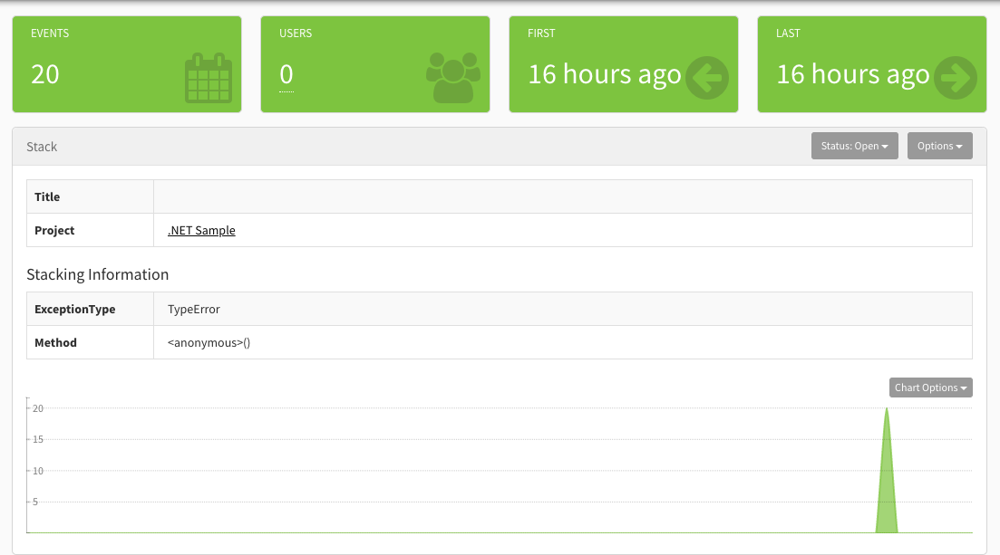
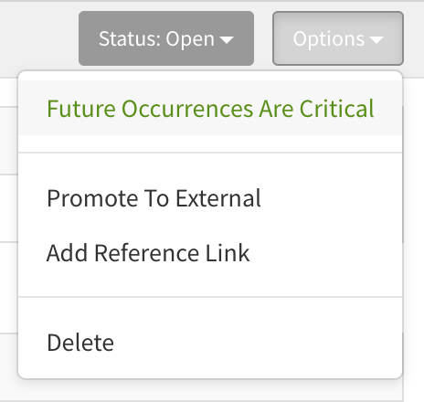

Perhaps the most important thing you'll do in Exceptionless is manage your stacks. Think of stacks as your todo list for error management. And like any good todo list, you can drill into a task for more details, mark the task complete, or set the task aside for a later date. 

Exceptionless will automatically group events into stacks and when you first sign in, you'll be taken to your dashboard on the Most Frequent view. 

Click on a stack you'd like to manage (We recommend you start with the most frequent event because that's probably pretty annoying for your customers 😉). Clicking on a stack will take you to a detailed view that includes important information such as how many times the event occurred, the number of users impacted, and the first and last occurences of the event. 

To apply a status on a stack, click the dropdown in the top-right and apply the appropriate selection. Selection options include: 

* Open  
* Fixed  
* Snoozed  
* Ignored  
* Discarded  

Marking the status of a stack will control your [filtering](filtering-and-searching) options, but it can also drive your workflow. Ignored stacks may be stacks you have no plans of addressing. Discarded stacks (which do not count against your plan quota) may be stacks that you can't easily prevent from coming through but you don't want to see and don't care about. Snoozing stacks allows you to be reminded at a future point to address the stack in question.

Beyond statuses, you have options to further control your stacks. 

