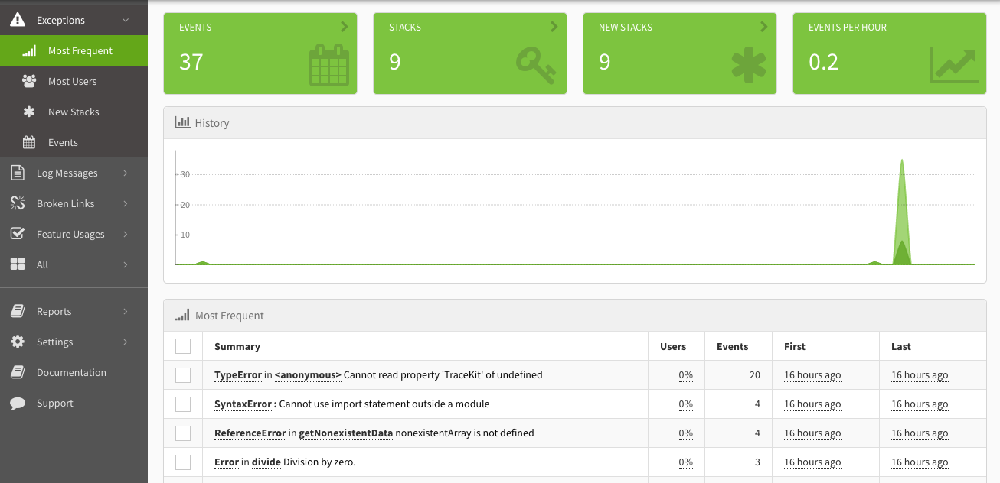
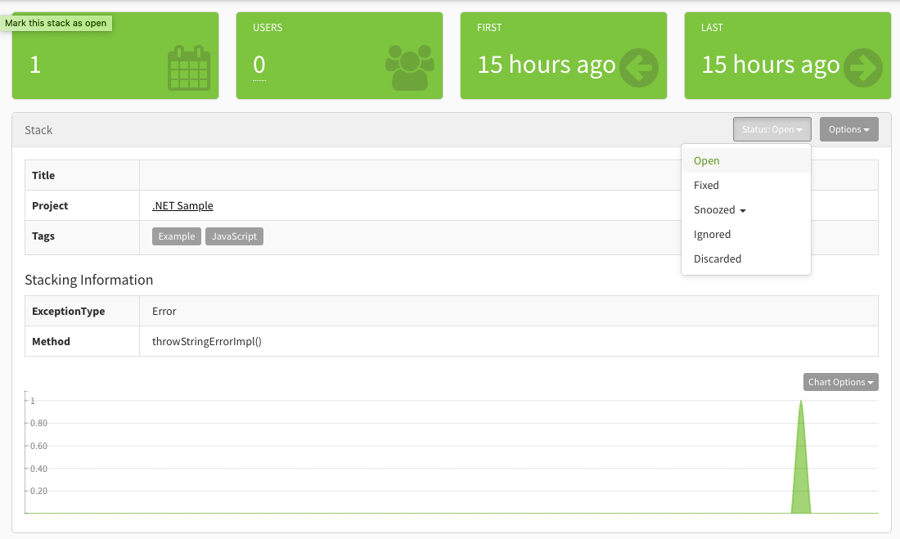

Perhaps the most important thing you'll do in Exceptionless is manage your stacks. Think of stacks as your todo list for error management. And like any good todo list, you can drill into a task for more details, mark the task complete, or set the task aside for a later date.

Exceptionless will automatically group events into stacks and when you first sign in, you'll be taken to your dashboard on the Most Frequent view.

Click on a stack you'd like to manage (We recommend you start with the most frequent event because that's probably pretty annoying for your customers 😉). Clicking on a stack will take you to a detailed view that includes important information such as how many times the event occurred, the number of users impacted, and the first and last occurences of the event.

To apply a status on a stack, click the dropdown in the top-right and apply the appropriate selection. Selection options include:

* Open  
* Fixed  
* Snoozed  
* Ignored  
* Discarded  

Marking the status of a stack will control your [filtering](filtering-and-searching.md) options, but it can also drive your workflow. Ignored stacks may be stacks you have no plans of addressing. Discarded stacks (which do not count against your plan quota) may be stacks that you can't easily prevent from coming through but you don't want to see and don't care about. Snoozing stacks allows you to be reminded at a future point to address the stack in question.

Let's take a look at each status in detail:

**Open** - This status indicates that the error is new or actively occurring. You will receive email notifications for these issues.

**Fixed** - Well, this one means you fixed it. If you look at Exceptionless as your todo list for errors, marking a stack as "Fixed" is like checking an item off your todo list. To be more specific, you won't get notifications if you have marked events as fixed. You will have the opportunity to provide your software's version number in which the fix was introduced. If another error comes through of the same kind and it matches the version number that was supposed to fix the issue, your stacks will be marked as "Regressed" instead of "Fixed". Additionally, if you mark a stack as Fixed but do not supply a version number in which it was fixed, should the event happen again, the stack will be marked as "Regressed".

**Snoozed** - Marking a stack as snoozed means you will not get email notifications for whatever period of time you indicate. This is like your alarm clock in the morning. You know you need to take action (like wake up or fix the bug), but you really don't want to yet. Snooze has your back. After the specified period of time, the stacks will once again start alerting you.

**Ignored** - When you ignore a stack, you will no longer receive email notifications unless you change the status. You may choose to do this when you have no intentions of resolving the issue but still want to collect information from the stacks.

**Discarded** - You should use this status when you do not care about the event at all. If "Ignored" is turning your back on an event and trying not to see it, "Discarded" is putting its feet in cement and dropping it into the middle of a lake. And since these events are sleeping with the fishes, they don't count against your plan quota.

Beyond statuses, you have options to further control your stacks.

Marking a stack with "Future Occurences are Critical" will automatically tag all subsequent events that come into that stack with the critical tag and will make them more prominent for you to review.

The "Promote to External" option allows you to send the stack details to an external source that you've configured through webhooks in the [Integrations](integrations.md) section. This can help you automate issue tracking and project management.

Adding a "Reference Link" allows you to supply to a link from an external source. This is helpful when a customer files a Github issue, for example. You can link to Github or to a Slack conversation, or anywhere, really.

Managing your stacks is the core focus within Exceptionless, and we try to automate as much as possible for you. However, it is possible to manually stack events, allowing you some of the same management tools outlined here.

---

[Next > Manual Stacking](manual-stacking.md) {.text-right}
