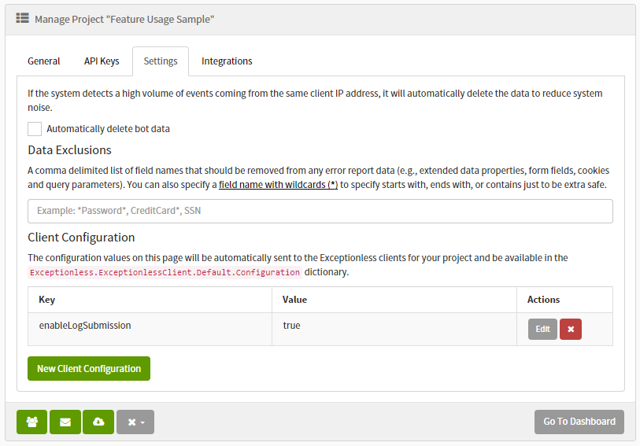

- [Clients](#clients)
- [Data Exclusions](#data-exclusions)
  - [Example usage](#example-usage)
- [Error Stacking](#error-stacking)
- [User Namespaces](#user-namespaces)
- [Common Methods](#common-methods)
- [Spam Detection](#spam-detection)
- [Client Configuration](#client-configuration)
- [Event Exclusions](#event-exclusions)
  - [Example](#example)
- [Using Client Configuration Settings](#using-client-configuration-settings)

All project settings are synced to the client in almost real time. When an event is submitted to Exceptionless we send down a response header with the current configuration version. If a newer version is available we will immediately retrieve and apply the latest configuration. We will also periodically check for newer configuration when the client is idle.

By default the client will check after `5 seconds` on client startup (*if no events are submitted on startup*) and then every `2 minutes` after the last event submission for updated configuration settings.

- Checking for updated settings doesn't count towards plan limits.
- Only the current configuration version is sent when checking for updated settings (no user information will ever be sent).
- If the settings haven't changed, then no settings will be retrieved.

You can also **turn off the automatic updating of configuration settings when idle** in each client respectively. Please see the client specific documentation:

## Clients

- [.NET](clients/dotnet/)
- [JavaScript / Node.js](clients/javascript/)

## Data Exclusions

A comma delimited list of field names that should be removed from any error report data (e.g., extended data properties, form fields, cookies and query parameters). Data Exclusions can be configured on the project settings page. You can also specify a field name with wildcards `*` to specify starts with, ends with, or contains just to be extra safe.

### Example usage

- Entering `Password` will remove any field **named** `Password` from the report.
- Entering `Password*` will remove any field that **starts with** `Password` from the report.
- Entering `*Password` will remove any field that **ends with** `Password` from the report.
- Entering `*Password*` will remove any field that **contains** `Password` from the report.

## Error Stacking

You can also control how errors are stacked by specifying user namespaces or common methods to ignore.

## User Namespaces

A comma delimited list of the namespace names that your applications code belongs to. If this value is set, only methods inside of these namespaces will be considered as stacking targets.

## Common Methods

A comma delimited list of common method names that should not be used as stacking targets. This is useful when your code contains shared utility methods that throw a lot of errors.

## Spam Detection

You can also specify a comma delimited list of user agents that should be ignored client side. This list supports wildcards and by default covers a vast major of bots. This helps reduce lots of noise.

## Client Configuration

Custom client configuration values allow you to control the behavior of your app in real time. They are a dictionary of key value pairs (string key, string value). Usage examples include controlling data exclusions to protecting sensitive data and or enabling/disabling features.

## Event Exclusions

The Exceptionless clients have the ability to automatically discard events based on client configuration settings! We have a plugin that looks at the client configuration settings using a simple key name convention.

To help us understand this consider that every event has a `Type` and `Source` property. The `Type` can be anything but we have a few first class types like [`error`, `usage`, `log`, `404`, `session`](https://github.com/exceptionless/Exceptionless/blob/master/src/Exceptionless.Core/Models/Event.cs#L92-L100). `Source` is usually set to the exception type when dealing with `error` events or the `log` source.

With that said, you can exclude any event type and source by adding a new client configuration key `@@EVENT_TYPE:SOURCE` by replacing the `EVENT_TYPE` and `SOURCE` respectively and specify a configuration value of `false`. _You can also specify a wild card `*` as part of the `SOURCE`!_

### Example

- To discard all errors of type `System.ArgumentNullException`:
  - **KEY:** `@@error:System.ArgumentNullException`
  - **VALUE:** `false`

- To discard all errors in general you would use a wildcard `*`:
  - **KEY:** `@@error:*`
  - **VALUE:** `false`

- To discard all 404s in general you would use a wildcard `*`:
  - **KEY:** `@@404:*`
  - **VALUE:** `false`

We have also added some additional known values to support **minimum log levels**! The known values are: `Trace`, `Debug`, `Info`, `Warn`, `Error`, `Fatal`, `Off`.

- Sets a minimum log level of `Info` for my application:
  - **KEY:** `@@log:*`
  - **VALUE:** `Info`

- You can also set a log level on a per log source basis. This will override any general minimum log level (e.g., `@@log:*` you have defined!
  - **KEY:** `@@log:*AuthController`
  - **VALUE:** `Trace`

## Using Client Configuration Settings

- [.NET](clients/dotnet/client-configuration-settings.md)
- [JavaScript / Node.js](clients/javascript/client-configuration-values.md)
