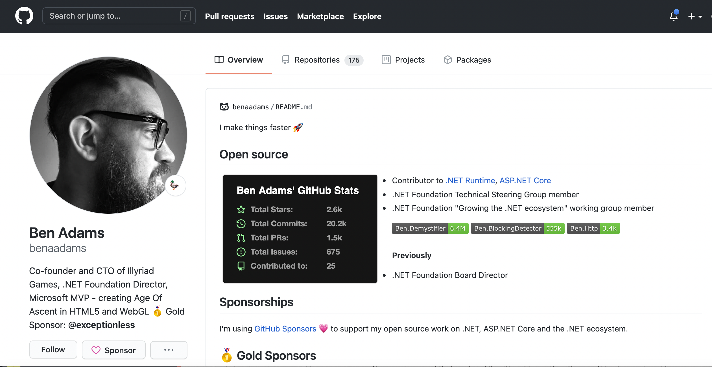

    
Exceptionless has always been committed to the open-source software ecosystem. In fact, [Exceptionless is entirely open-source](https://github.com/Exceptionless), and we try our best to make it easy for anyone to host their own instance of our software. Our main repository has nearly 2,000 stars on Github and has seen contributions from 26 different people. Across all our repositories, we've seen hundreds of issues opened, dozens of pull requests, and countless comments. And for all of that, we are so appreciative. But we wanted to show our appreciation by doing more than just saying thanks. 

## Thanking Open Source Contributions Through Sponsorship

Today, we're excited to announce that [we have sponsored Ben Adams](https://github.com/sponsors/benaadams) through the Github Sponsors program. As you all know, we are huge fans of .NET, and Exceptionless is one of the only monitoring tools built around the .NET ecosystem first. Ben, like us, cares deeply about open-source software and the .NET community. We hope that by sponsoring him, we will be giving back in a tangible way, not just to Ben but to the sustainability of open-source. 

Before diving into more about who Ben is and why we're sponsoring him specifically, it might be good to reflect on the importance of sustainable open-source development. Exceptionless survives through a hosted service, but many open-source projects don't have that option. This leaves maintainers in the unenviable position of having to write software, fix bugs, and respond to issues while receiving nothing more than "thanks" as payment. 

"Thanks" doesn't pay the bills. Exposure doesn't pay the bills. 

We don't want to see open-source developers shut down their projects. We want developers to have optionality. [A quote from Kitze](https://medium.com/@kitze/github-stars-wont-pay-your-rent-8b348e12baed), the founder of Sizzy and other products, really illustrates this sentiment well: 

> Open source, writing blog posts, and playing with tweaking lint settings and editor themes all day are completely fine until your landlord knocks on your door or you’re at the checkout at the grocery store.  

It's not just the viability of creating open-source software that becomes a problem, it's also the long-term sustainability when larger companies use that software. When we see companies like Amazon abuse open-source contributions, we see a door closing on the viability of software that is designed to survive through community and contribution. 

So, while Exceptionless might not change the world by itself with its sponsorship, we want to lead by example. As Kitze said, Github stars don't pay the bills, but money does. So, we're opening our wallet and helping Ben Adams do what he's done so well for years. 

## Ben Adams 

Ben has been working on open-source projects for years. He has thousands of contributions across dozens of repositories. In fact, he is so prolific in his .NET contributions that everyone else with more contributions than him are Microsoft employees. It doesn't get more impressive than that. Here's a quick summary of Ben's open-source contributions: 

* His projects have 2,600 Github stars (which, again, don't pay the bills 😉)
* He has over 20,000 commits
* He has contributed to 25 different projects
* He's opened over 1,500 pull requests

It should be clear by now that Ben knows his stuff. Somehow, in addition to making all these open-source contributions, Ben also serves as the .NET Foundation Director. As mentioned before, Ben cares a whole lot about .NET, and so do we. So, this sponsorship makes perfect sense for us. 

For the gamers and the game developers, Ben has you covered too. He is the CTO of Illyriad Games which makes [Age of Ascent}(https://www.ageofascent.com/). Age of Ascent is a real-time MMO that puts players in the cockpits of fighter ships in space. As you might expect, the game's tech stack [makes heavy use of .NET](https://youtu.be/dqYlKkexth0) and other Microsoft-related services. 

Other people recognize Ben's contributions too: 

> Since the beginning of the .NET Core journey we’ve had some amazing contributors but I seriously enjoy working with 
@ben_a_adams!
-[David Fowler](https://twitter.com/davidfowl/status/1353087429364879361)

> There's smart, then there's crazy. Then there's Crazy Smart. That's Ben (and he's a lovely chap, too)!
-[Rich Turner](https://twitter.com/bitcrazed/status/1354144181837414400)

> If it wasn't for him the dotnet project would never took off as much as it did, since six years ago extreme performance optimizations were brushed off as not really needed. He single-handed restored everyone's faith in the project and that it still has a bright future. 
-[Bartosz Adamczewski](https://twitter.com/badamczewski01/status/1353666677792272387)

## How Does Sponsorship Work?

Github Sponsors allows each developer to define what comes along with sponsorship at various levels. Ben was gracious enough to offer his own development time to Gold Level sponsors, and we simply could not pass that up. While we would be happy to simply sponsor Ben's work, having him contribute code to our open-source repositories will help Exceptionless take a major step forward. 

Sponsoring open-source developers is not a new concept, but having it built into Github has help elivate the visibility of portential sponsorship opportunities. We hope that by having companies like Exceptionless sponsor (and publicize those sponsorships) developers, it will encourage others to do the same. Open-source sustainability still has a long way to go, but any step forward we can help the ecosystem take, we're willing to do it. 

Thanks so much, Ben! We look forward to working with you and following your continued contributions across the open-source community. 