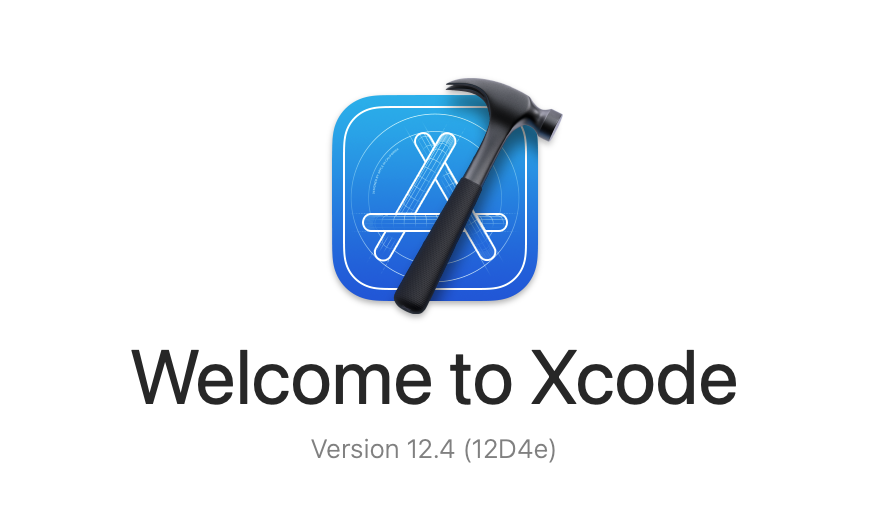
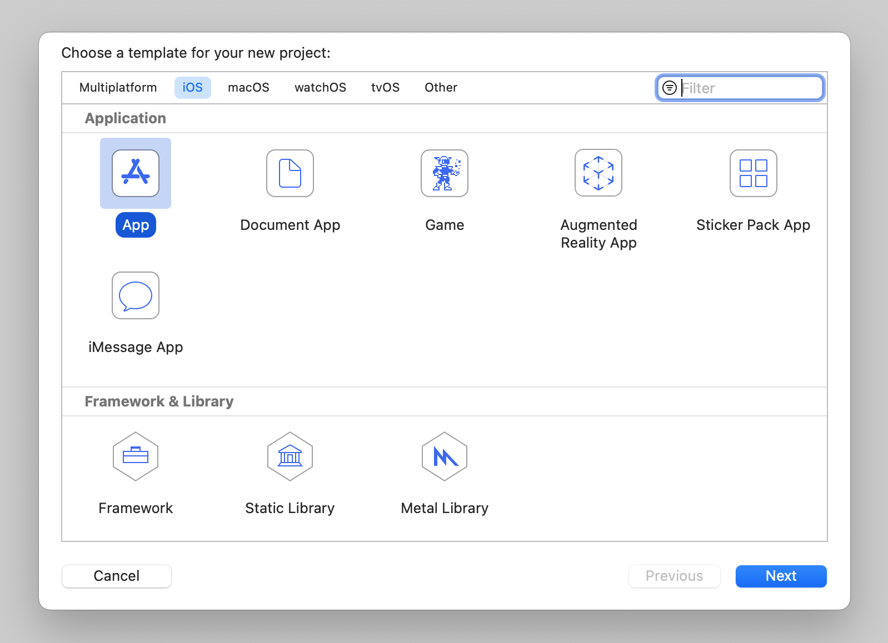
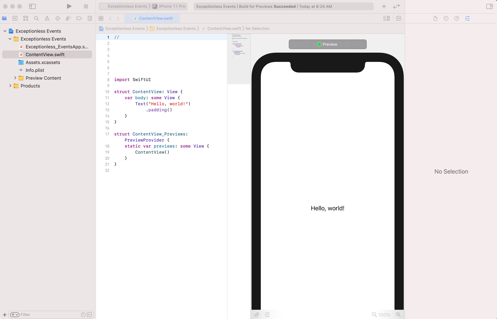

Swift, best known as the programming language that enables iOS, iPadOS, and macOS developers to build apps, has been growing in popularity over the years. [As of February of 2020](https://www.zdnet.com/article/programming-language-popularity-apples-objective-c-tumbles-down-the-rankings/), it had leaped into the top-10 of most popular programming languages. While Swift can be used for more than just Apple platform products, we're going to keep things simple today and focus on how to set up event monitoring with Swift in an iOS app. 

For this tutorial, we're going to be using [Exceptionless to collect events, so you'll need to sign up for a free account here](https://exceptionless.com). You're also going to need the following: 

* Mac computer (sorry Windows and Linux folks)
* Xcode
* Xcode command line tools

## Getting Set Up

If you don't already have Xcode installed on your Mac, do so now. [You can grab an install here](https://developer.apple.com/xcode/). If you already have it installed, you will need to make sure you are upgraded to Xcode 12. To check your version, open Xcode and check to see that you have version 12 or above. It'll look like this: 



Once you're done installing it, you can check that everything was successful by either firing up Xcode or running the command I showed above. Now, we need to make sure you have the Xcode command line tools. These should be installed automatically when you install Xcode, but we want to be sure. To check if these were installed, run the following in Terminal: 

```
xcode-select -p
```

If a path is printed out, you're all good. That's all you need. Open up Xcode, and we'll get started. 

## Creating a Project 

Once you've opened Xcode, you're going to create a new project. Choose iOS and choose App, then click Next. 



Next, you'll give the app a name in the Product Name section. I'll call mine Exceptionless Events. Make sure your interface is SwiftUI, your lifecycle is SwiftUI App, and your language is Swift. Then, click Next. 

You'll be asked where you want to store your code. Choose a folder that makes sense for you. When you've done that, your new project will load up. It should look like this: 



We're not going to spend a lot of time building an actual iOS app here, but we'll add enough functionality to test errors and test logging events. To set ourselves up, we're going to create two buttons in the UI. So, inside your `ContentView.Swift` file, replace the `Text` element with this: 

```swift
VStack{
    Spacer()
    Button(action: {}) {
        Text("Log Message")
    }
    Spacer()
    Button(action: {}) {
        Text("Log Error")
    }
    Spacer()
}
```

Note: the `Spacer` items are just there to make the screen a little more manageable (not necessarily prettier). Each button has a label and each has an action. However, the actions don't do anything just yet. We'll get that taken care of next.

Above your `body` declaration, add these two functions: 

```swift
private func submitEvent() {
    print("event")
}
private func submitError() {
    print("error")
}
```

Then, back inside your body, change each button's action to call the associated function like this: 

```swift
VStack{
    Spacer()
    Button(action: submitEvent) {
        Text("Log Message")
    }
    Spacer()
    Button(action: submitError) {
        Text("Log Error")
    }
    Spacer()
}
```

Just to test that everything is working, click the play button at the top of the Xcode window. This will build the app and launch a simulator. Click each button and make sure "event" and "error" print out in the console. Pro tip: the console may be shrunk down and hidden. At the bottom of your Xcode window, hover over the section that looks like this and drag to increase the window size so you can see the console.


Assuming all is working, we can move on to using Exceptionless!

## Creating the Exceptionless Class

We're going to handle all of the event processing and posting through a single class. You may want to refactor into multiple classes in a production project, but this will get the point across, I think. 

Let's create a new file. In the file menu bar, click File, New, File, and be sure to choose a Swift file and not SwiftUI. Let's name the new file `Exceptionless.swift`. 

Inside that file, we're going to create our `Exceptionless` class. Add the following so your file looks like this: 

```swift
import Foundation

class Exceptionless {
    var apiKey: String
    init(apiKey: String) {
        self.apiKey = apiKey
    }
    
    func submit(type: String, event: String) {
        switch type {
        case "log":
            print("log")
        case "error":
            print("error")
        default:
            print("log")
        }
    }
    
    private func logMessage(logMessage: String) {
       
    }
    
    private func logError(errorEvent: String) {
        
    }
}
```

This class doesn't do anything besides accept the Exceptionless API key, but you can see we're starting to frame out how to build our event monitoring system. To keep things simple, the `submit` function accepts a type of event (in string form) and it accepts the event string. The event string for the purposes of this example should be a simple log message or error message.

Let's test what we have out so far. We want to connect our two buttons from earlier to the function, `submit`, that we created in the `Exceptionless` class. We should see the console print out "log" or "error" depending on what button we press. 

Back inside your `ContentView.swift` file, replace the actions for each button like this: 

```swift
var body: some View {
    VStack{
        Spacer()
        Button(action: {Exceptionless.init(apiKey: "YOUR API KEY").submit(type: "log", event: "Log Message")}) {
            Text("Log Message")
        }
        Spacer()
        Button(action:{Exceptionless.init(apiKey: "YOUR API KEY").submit(type: "error", event: "Log Error")}) {
            Text("Log Error")
        }
        Spacer()
    }
}
```

This is a very simplified example. In reality, your buttons would be calling some other action and you'd be catching errors or logging events dependent on what that action does. Let's test this out, though. We don't actually need an API Key yet, so leave the `apiKey` string as is. Run your project on a simulator and click each button. You should see "log" and "error" printed in the console. 

Congratulations! You just built a class within Swift that will act as the framework for submitting events. 

## Building Events

We're going to keep things simple. [The Exceptionless API](https://api.exceptionless.io/docs/index.html) has some great documentation and some simple examples that we'll be making use of. Let's start by updating out switch statement to actually call the functions specific to events or errors: 

```swift
func submit(type: String, event: String) {
    switch type {
    case "log":
        return logMessage(logMessage: event)
    case "error":
        return logError(errorEvent: event)
    default:
        print("log")
    }
}
```

You can do whatever you'd like with your default case. I'm going to keep it as a print statement, though. What we've done is we've said if we call `submit` with a type of "log", we will call the `logMessage` function. If we call `submit` with a type of "error", we will call the `logError` function. 

Let's build out the `logMessage` function fist. Replace the existing empty function with this:

```swift
private func logMessage(logMessage: String) {
    let now = Date()
    let formatter = ISO8601DateFormatter()
    let datetime = formatter.string(from: now)
    let eventDictionary : [String: Any] = [ "type": "log", "message":logMessage, "date": datetime ]
    let jsonData = (try? JSONSerialization.data(withJSONObject: eventDictionary, options: []))!
    let jsonString = String(data: jsonData, encoding: String.Encoding.ascii)!
    print (jsonString)
}
```

Because the Exceptionless API takes JSON body payloads, we want to build our event into JSON. To do that, we first start with a dictionary. As you can see, we are creating an `eventDictionary` which is simply keyvalue pairs in string format. We add in the date in ISO format so we know when our events happen. The actual event message is what we passed in all the way back from when we clicked the button. 

We take that dictionary and convert it to JSON with Swift's built-in `JSONSerialization` function. Before posting to the API, let's take a look at the output in the console and make sure we're happy with it. 

Build and run the app, then click "Log Message". You should see the following printed in the console: 

```
{"message":"Log Message","date":"2021-04-05T13:34:39Z","type":"log"}
```

Your date will, of course, be different. 

Ok, we've gotten this far. Let's build our error function. Don't worry, we'll come back and think about how we want to actually post these events to Exceptionless. 

Replace the empty `logError` function with this: 

```swift
private func logError(errorEvent: String) {
    let now = Date()
    let formatter = ISO8601DateFormatter()
    let datetime = formatter.string(from: now)
    
    let errorDictionary : [String: Any] = ["message": errorEvent, "type": "System.Exception"]
    
    let errorJson = (try? JSONSerialization.data(withJSONObject:errorDictionary, options: []))!
    let errorJsonString = String(data: errorJson, encoding: String.Encoding.ascii)!
    let eventDictionary : [String: Any] = [ "type": "error", "@simple_error":errorJsonString, "date": datetime ]
    let jsonData = (try? JSONSerialization.data(withJSONObject: eventDictionary, options: []))!
    let jsonString = String(data: jsonData, encoding: String.Encoding.ascii)!
    print (jsonString)
}
```

You'll see this function is very similar to the `logMessage` function. However, we are nesting data in our JSON, so we need two dictionaries. We use one dictionary to house the "@simple_error" and another to house the entire event. In other words, nest the JSON version of our `errorDictionary` inside the JSON version of our `eventDictionary`.

Let's build and run the app and try both buttons. You should see the following printed out: 

```
{"message":"Log Message","date":"2021-04-05T13:46:58Z","type":"log"}
{"type":"error","@simple_error":"{\"message\":\"Log Error\",\"type\":\"System.Exception\"}","date":"2021-04-05T13:46:59Z"}
```

Your dates will be different, but the rest should look about the same. We now have a Log Event AND an Error Event. I think we're ready to post to the Exceptionless API. 

Remember, if you haven't done so, you'll need to sign up for a [free Exceptionless account](https://exceptionless.com), create a project, and grab an API Key. 

## Posting To The API

When we post to the Exceptionless API, we are posting JSON data. In the examples above, we are printing the JSON string version of what we will ultimately push to the API. Let's see how it will look when actually posting to the API. 

Within our Exceptionless class, let's create a new private function called `postToAPI`. 

```swift
private func postToApi(event: Data) {
    let url = URL(string: "https://collector.exceptionless.com/api/v2/events")!

    var request = URLRequest(url: url)
    request.httpMethod = "POST"

    // insert json data to the request
    request.httpBody = event
    request.setValue("application/json; charset=utf-8",
         forHTTPHeaderField: "Content-Tye")
    request.setValue("application/json; charset=utf-8",
         forHTTPHeaderField: "Accept")
    request.setValue("Bearer " + self.apiKey,
         forHTTPHeaderField: "Authorization")

    let task = URLSession.shared.dataTask(with: request) { data, response, error in
        guard let data = data, error == nil else {
            print(error?.localizedDescription ?? "No data")
            return
        }
        let responseJSON = try? JSONSerialization.jsonObject(with: data, options: [])
        if let responseJSON = responseJSON as? [String: Any] {
            print(responseJSON)
        }
    }

    task.resume()
}
```

Walking through this new function, let's take a look at what's going on. First, we are setting the URL for our API request. This is a hardcoded value and probably not something you'd want to do in a production application. 

Next, we are creating a new request and assigning values to the request. You'll note that our `postToAPI` function accepts a `Data` value argument called `event`. That is what we will be posting to the API and it represents the JSON version of the event we build when we click Log Message or Log Error. 

Then, we set header values for our request. Take note, that we are assigning the `Authorization` value by using our Exceptionless API key. We'll need to get that key from Exceptionless before actually sending events. \

Finally, we are posting the request using `URLSession`. 

To actually call this function, we need to make two minor changes. First, back in your `ContentView.swift` file, we need to add our Exceptionless API key in where we left placeholder text. Again, this is not how you'd assign the API Key in a production app, but it's a simple example to get you going. 

Now, back in the `Exceptionless.swift` file, let's update both the `logMessage` and `logError` functions. Instead of converting our event to a JSON string, we're going to leave it as JSON and pass it through to our `postToAPI` function like this: 

```swift
private func logMessage(logMessage: String) {
    let now = Date()
    let formatter = ISO8601DateFormatter()
    let datetime = formatter.string(from: now)
    let eventDictionary : [String: Any] = [ "type": "log", "message":logMessage, "date": datetime ]
    let jsonData = (try? JSONSerialization.data(withJSONObject: eventDictionary, options: []))!
    postToApi(event: jsonData)
}
```

And here's the `logError` function: 

```swift
private func logError(errorEvent: String) {
    let now = Date()
    let formatter = ISO8601DateFormatter()
    let datetime = formatter.string(from: now)
    
    let errorDictionary : [String: Any] = ["message": errorEvent, "type": "System.Exception"]
    
    let errorJson = (try? JSONSerialization.data(withJSONObject:errorDictionary))!
    let errorJsonString = String(data: errorJson, encoding: String.Encoding.ascii)!
    let eventDictionary : [String: Any] = [ "type": "error", "@simple_error":errorJsonString, "date": datetime ]
    let jsonData = (try? JSONSerialization.data(withJSONObject: eventDictionary))!

    postToApi(event: jsonData)
}
```

Go ahead and build and run your app. Click the Log Message button and then the Log Error button. You won't see anything printed in the console, but if you go into your Exceptionless dashboard, you should see a new log and a new exception. 


Congratulations! You just built a simple event monitoring service in native Swift code. You can extend this pretty easily thanks to the Exceptionless class and leverage it in a production application. 

Swift is a fun language, but when using it to build mobile applications, it can be difficult to debug and track events. Exceptionless can help, and hopefully this tutorial shows how to implement such event tracking in SwiftUI and Swift. 

If you'd like to see the sample Xcode project, [we have a repo for it here](https://github.com/exceptionless/Exceptionless-Swift-Example).